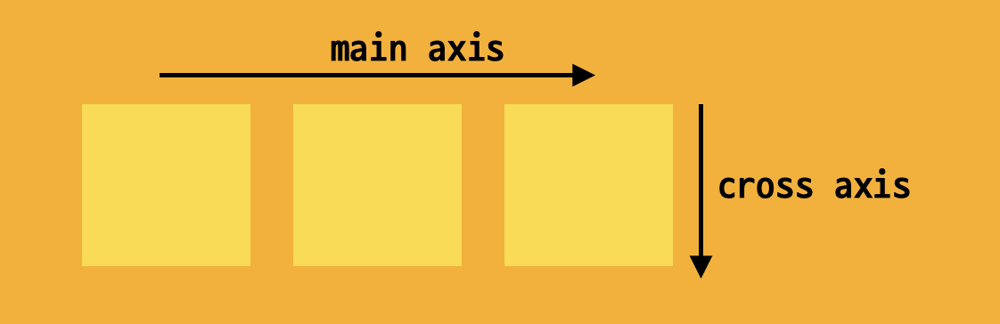

# Web DAY4

 

🔒 **학습 목차**

`Web`

## CSS

### 💡 Position

> 문서 상에서 요소의 위치를 지정

#### `static`

- 모든 태그의 기본 값 (기준 위치)

- 일반적인 요소의 배치 순서에 따름 (좌측 상단)
- 부모 요소 내에서 배치될 때는 부모 요소의 위치를 기준으로 배치 됨

 

#### `relative`

> 상대 위치

static : 포지션의 기본 값 일반적인 요소의 배치 순서에 따름 좌측상단

relative : 상대 위치

- 자기 자신의 위치를 기준으로 이동 

absolute : 절대 위치

`absolute`

`fixed`

`sticky`

aboslute fixed sticky nomal flow에서 벗어나 있는 것

좌/우측 배치

justify content 중심 축에서 아이템을 어떻게 배치하는가

align items baseline는 만약 아이템에 패딩이 있어서 아이템 안에 있는 내부의 글자들의 위치가 달라졌을때 텍스트를 모두 일직선에 있게 보여줘 라고 할때